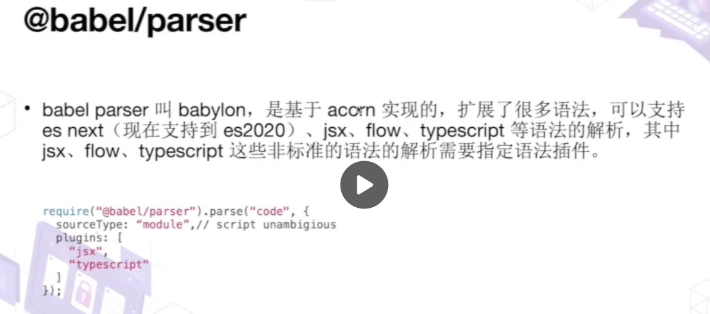
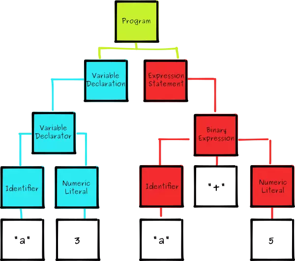
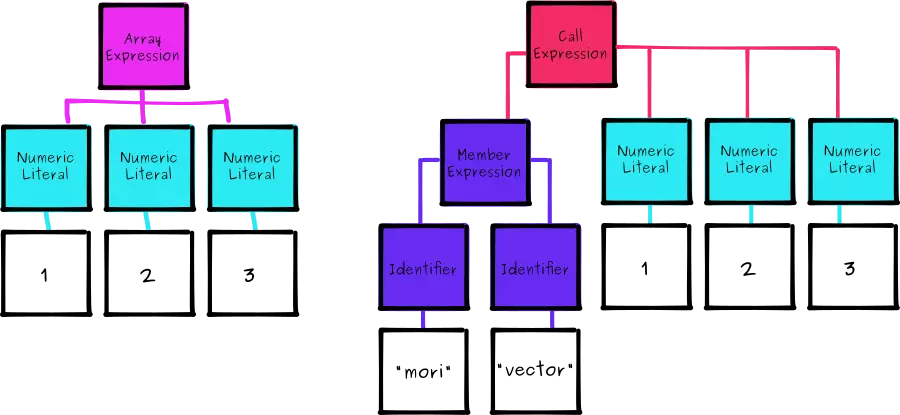
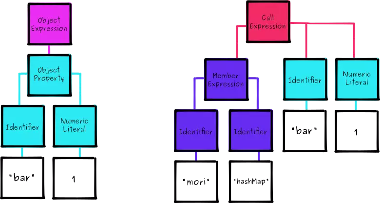
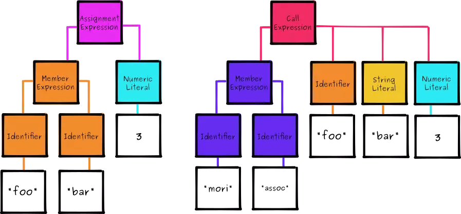
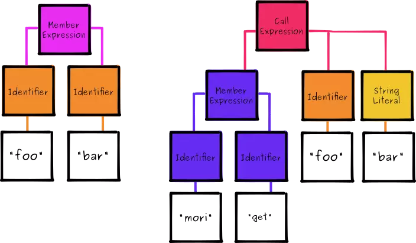

# Babel Overview
## 功能
- 语法转换
- 通过 Polyfill 的方式在目标环境中添加缺失的特性
- JS源码转换

## 基本原理及组成


根据上图可以看到babel主要由三部分组成：

- `Parse`：使用`@babel/parser`——将源码转为计算机易于理解的AST；即babylon`，是基于`acorn`实现的
- `Transform`：使用`@babel/traverse`——可以遍历AST，并调用visitor函数修改AST；修改AST会涉及到AST的判断、创建、修改等，这时候就用到`@babel\types`，当需要批量创建AST时可以使用`@babel/template`来简化创建逻辑
- `Generator`：使用`@babel/generator`将转化过的AST生成目标代码字符串，同时生成sourcemap；

- babel的整体功能通过`@babel/core`提供，基于上面的包完成整体编译流程并实现插件功能




## what's ast?

对于一段代码，电脑无法感知其中有多少变量或者函数，对它来说，都是一个个内存中的数值；因此，`需要找出折中方案将我们的代码转为一种我们可编程并且计算机可理解的产物`；

以下面代码为例
```js
var a = 3;
a + 5

```
我们为上面的代码生成AST时，会得到如下结构：


> 所有的AST都以`Program`为根节点，它包含了我们程序中的所有顶级声明；上面例子中有2个：`VariableDeclaration`和`ExpressionStatement`

可以通过以下工具帮助理解JS到AST的转换
1. https://astexplorer.net/
2. https://resources.jointjs.com/demos/javascript-ast

## babel配置
#### babel.config.js
```js
module.exports = function(api) {
  api.cache(true);
  const presets = [...];
  const plugins = [...];

  return {
    presets,
    plugins,
  }
}
```

#### .babelrc
```bash
{
  "presets": [...],
  "plugins": [...],
}
```


#### package.json中配置

```
{
  ...
  "babel": {
    "presets": [...],
    "plugins": [...],
  }
}
```

#### presets与plugins

plugins是一系列plugin的集合，plugin用来定义具体如何转换你的代码，如从箭头函数到普通函数；

> 插件（plugin）执行顺序是从左到右，会在presets之前执行

```js
// 插件传参
{
  "plugins": [
    "transform-decorators-legacy",
    [
      "@babel/plugin-proposal-class-properties",
      { "loose": true }
    ]
  ]
}

```

presets本质是多个插件的组合，比如 @babel/preset-react是下列plugin的组合

所以presets的自定义结构一般是
```js
elperPluginUtils.declare)((api, opts) => {
  return {
    plugins: [...]
  }
}
```

> 需要注意的是，`presets`的执行顺序是从右到左的，与`plugins`相反


## 一些常见的预设（presets）
#### @babel/preset-stage-xxx
@babel/preset-stage-xxx 是 ES 在不同阶段语法提案的转码规则而产生的预设

- stage-0：设想（strawman），stage-0的功能范围最大，包含了stage-1、stage-2、stage-3的所有功能；
- stage-1：建议（Proposal）
- stage-2：草案（Draft）
- stage-3：候选（Candidate）
- stage-4：完成（Finish）

#### @babel/preset-es2015
> preset-es2015 是仅包含 ES6 功能的 Babel 预设

> 实际上在 Babel7 出来后上面提到的这些预设 stage-x，preset-es2015 都可以废弃了，因为 @babel/preset-env 出来一统江湖了。

#### @babel/preset-env
`前面两个预设是从 ES 标准的维度来确定转码规则的，而 @babel/preset-env 是根据浏览器的不同版本中缺失的功能确定代码转换规则的`，在配置的时候我们只需要配置需要支持的浏览器版本就好了，@babel/preset-env 会根据目标浏览器生成对应的插件列表然后进行编译：

```js
  "presets": [
    "env": {
      "targets": {
        "browsers": ["last 10 versions", "ie >= 9]
      }
    }
  ]
```

> 在`默认情况下 @babel/preset-env 支持将 JS 目前最新的语法转成 ES5`，但需要注意的是，如果你代码中用到了还没有成为 JS 标准的语法，该语法暂时还处于 stage 阶段，这个时候还是需要安装对应的 stage 预设，不然编译会报错。

> @babel/preset-env 在默认情况下和 preset-stage-x 一样`只编译语法，不会对新方法和新的原生对象进行转译`

如Array.includes方法不会被处理，这时候就需要polyfill了


## polyfill

polyfill 的翻译过来就是垫片，垫片就是垫平不同浏览器环境的差异，

#### @babel/polyfill
@babel/polyfill模块可以模拟完整的ES5环境

> 注意 @babel/polyfill 不是在 Babel 配置文件中配置，而是在我们的代码中引入。
```js
import '@babel/polyfill';
const arrFun = ()=>{}
const arr = [1,2,3]
console.log(arr.includes(1))
Promise.resolve(true)

```
这里是require("@babel/polyfill")将`整个 @babel/polyfill 加载`进来了，但是在这里我们需要处理 Array.includes 和 Promise 就好了，如果这样就会导致我们最终打出来的包体积变大，显然不是一个最优解。且看`useBuiltIns`

#### useBuiltIns
`@babel/preset-env`基本实现了大一统，它提供了`useBuiltIns`参数用于Babel编译时进行自动polyfill，这样可以做到按需加载

```js
{
  "presets": [
    "@babel/preset-flow",
    [
      "@babel/preset-env",
      {
        "targets": {
          "node": "8.10"
        },
        "corejs": "3", // 声明 corejs 版本
        "useBuiltIns": "usage"
      }
    ]
  ]
}
```

`usesBuiltIns`参数列表
- `false`: 不会按需加载，会引入所有polyfill;
- `usage`：据配置的浏览器兼容性及代码中使用到的 API 来进行 Polyfill ，实现按需加载，
- `entry`：同`usage`但是需要在入口处引入`import ' @babel/polyfill'`


## 写一个babel插件

### babel插件基础

基础结构都是返回一个可以遍历所有节点的`visitor`对象，内部定义了对不同类型节点的修改。

```
module.exports = function(babel) {
  return {
    visitor: {

    }
  };
};
```


当写一个babel插件时，我们所需要做的其实就是接收一个AST然后对它进行节点的移动、插入、删除、替换等生成一个新的AST

我们要实现一个插件，借助`MoriScript`将下面的代码转换
```js
var foo = { a: 1 };
var baz = foo.a = 2;
foo.a === 1;
baz.a === 2;
```

转化后的结果为
```js
var foo = mori.hashMap('a', 1);
var baz = mori.assoc(foo, 'a', 2);
mori.get(foo, 'a') === 1;
mori.get(baz, 'a') === 2;
```

### 编写插件要点
- 确定要修改的节点类型
- 找到AST中需要修改的属性
- 将AST中需要修改的属性用新生成的属性对象替换

`sourceCode->AST`及`new AST->ouput code`的转换由babel替我们完成

### Setup

首先初始化项目，安装依赖`@bable-core`
```bash
npm install --save-dev @bable-core
```

然后创建一个函数，对外暴露接口`visitor`;
```js
// moriscript.js
module.exports = function(babel) {
  var t = babel.types;
  return {
    visitor: {

    }
  };
};
```

接着创建一个`runner`用于测试我们的plugin
```js
var fs = require('fs');
var babel = require('@babel/core');
var moriscript = require('./moriscript');

// read the filename from the command line arguments
var fileName = process.argv[2];

// read the code from this file
fs.readFile(fileName, function(err, data) {
    if (err) throw err;

    // convert from a buffer to a string
    var src = data.toString();

    // use our plugin to transform the source
    babel.transform(src, {
        plugins: [moriscript],
        sourceMaps: 'both',
    }, function(err, result) {
        console.log('result --', result); // result: { code, map, ast }
    });
});

```
编写以下代码用于测试
```js
let a = 2;

const arr = [];

function add(a, b) {
    return a + b;
}
```

运行命令：`node Babel/moriscript/run.js Babel/moriscript/index.js `

输出结果如下：
```js
result -- {
  metadata: {},
  options: {
    assumptions: {},
    sourceMaps: 'both',
    targets: {},
    cloneInputAst: true,
    babelrc: false,
    configFile: false,
    browserslistConfigFile: false,
    passPerPreset: false,
    envName: 'development',
    cwd: 'D:\\suheng\\test\\FE-Engineering',
    root: 'D:\\suheng\\test\\FE-Engineering',
    rootMode: 'root',
    plugins: [ [Plugin] ],
    presets: [],
    parserOpts: { sourceType: 'module', sourceFileName: undefined, plugins: [] },
    generatorOpts: {
      filename: undefined,
      auxiliaryCommentBefore: undefined,
      auxiliaryCommentAfter: undefined,
      retainLines: undefined,
      comments: true,
      shouldPrintComment: undefined,
      compact: 'auto',
      minified: undefined,
      sourceMaps: 'both',
      sourceRoot: undefined,
      sourceFileName: 'unknown'
    }
  },
  ast: null,
  code: 'let a = 2;\n' +
    'const arr = [];\n' +
    '\n' +
    'function add(a, b) {\n' +
    '  return a + b;\n' +
    '}\n' +
    '//# sourceMappingURL=data:application/json;charset=utf-8;base64,eyJ2ZXJzaW9uIjozLCJzb3VyY2VzIjpbInVua25vd24iXSwibmFtZXMiOlsiYSIsImFyciIsImFkZCIsImIiXSwibWFwcGluZ3MiOiJBQUFBLElBQUlBLENBQUMsR0FBRyxDQUFSO0FBRUEsTUFBTUMsR0FBRyxHQUFHLEVBQVo7O0FBRUEsU0FBU0MsR0FBVCxDQUFhRixDQUFiLEVBQWdCRyxDQUFoQixFQUFtQjtBQUNmLFNBQU9ILENBQUMsR0FBR0csQ0FBWDtBQUNIIiwic291cmNlc0NvbnRlbnQiOlsibGV0IGEgPSAyO1xyXG5cclxuY29uc3QgYXJyID0gW107XHJcblxyXG5mdW5jdGlvbiBhZGQoYSwgYikge1xyXG4gICAgcmV0dXJuIGEgKyBiO1xyXG59Il19',
  map: {
    version: 3,
    sources: [ 'unknown' ],
    names: [ 'a', 'arr', 'add', 'b' ],
    mappings: 'AAAA,IAAIA,CAAC,GAAG,CAAR;AAEA,MAAMC,GAAG,GAAG,EAAZ;;AAEA,SAASC,GAAT,CAAaF,CAAb,EAAgBG,CAAhB,EAAmB;AACf,SAAOH,CAAC,GAAGG,CAAX;AACH',
    sourcesContent: [
      'let a = 2;\r\n' +
        '\r\n' +
        'const arr = [];\r\n' +
        '\r\n' +
        'function add(a, b) {\r\n' +
        '    return a + b;\r\n' +
        '}'
    ]
  },
  sourceType: 'module'
}
```

上面babel配置中开启了`sourceMap`，可以同时看下sourceMap的转换

### Arrays

`MoriScript`的首要目标是将对象和数组转为Mori的对应结构：`HashMaps`和`Vectors`

```js
var bar = [1, 2, 3];
// should become
var bar = mori.vector(1, 2, 3);
```

为了可读性，我们会省略一些元数据字段，上面的数组赋值语句可以表示为
```js
{
  "type": "ArrayExpression",
  "element": [
    {
      "type": "NumericLiteral",
      "value": 1,
    },
    {
      "type": "NumericLiteral",
      "value": 2,
    },
    {
      "type": "NumericLiteral",
      "value": 3,
    },
  ]
}
```


我们用同样的形式表示`mori.vector(1, 2, 3)`;
```js
{
  "type": "CallExpression",
  "callee": {
    "type": "MemberExpression",
    "object": {
      "type": "Identifier",
      "name": "mori"
    },
    "property": {
      "type": "Identifier",
      "name": "vector"
    }
  },
  "arguments": [
    {
      "type": "NumericLiteral",
      "value": 1,
    },
        {
      "type": "NumericLiteral",
      "value": 2
    },
    {
      "type": "NumericLiteral",
      "value": 3
    }
  ]
}
```

通过以上JSON结构，我们可以看到两者的异同；为了更加形象，我们可以使用下图树形结构表示：




看到这里，我们应该知道了我们的插件转换`Array`到`mori.vector`时需要如何做了。

> 可以看到，我们需要替换顶级表达式类型，同时复用数值相关的结构；

下面我们开始在我们的插件中添加一个`ArrayExpression`方法

```js
module.exports = function(babel) {
  var t = babel.types;
  return {
    visitor: {
      ArrayExpression: function(path) {

      }
    }
  };
};

```

> babel遍历AST时会查看每一个节点，如果发现在我们的插件的`visitor`对象中存在相应的方法，它会把上下文传入到该方法，所以我们可以分析或者操作它

```js
module.exports = function(babel) {
  var t = babel.types;
  return {
    visitor: {
      ArrayExpression: function(path) {
        path.replaceWith(
          t.callExpression(
            t.memberExpresion(t.identifier('mori'), t.identifier('vector')),
            path.node.elements
          )
        );
      }### Objects

      ```js
var foo = { bar: 1 };
// should become
var foo = mori.hashMap('bar', 1);
      ```

      对象字面量和数组有着类似的结构
      ```js
{
  "type": "ObjectExpression",
  "properties": [
    {
      "type": "ObjectProperty",
      "key": {
        "type": "Identifier",
        "name": "bar"
      },
      "value": {
        "type": "NumericLiteral",
        "value": 1
      }
    }
  ]
}
      ```
    }
  };
};
```

> // We can find [documentation](https://github.com/babel/babel/tree/master/packages/babel-types#babel-types) for each type of expression with the `babel-types` package.


### Objects

```js
var foo = { bar: 1 };
// should become
var foo = mori.hashMap('bar', 1);
```

对象字面量和数组有着类似的结构
```js
{
  "type": "ObjectExpression",
  "properties": [
    {
      "type": "ObjectProperty",
      "key": {
        "type": "Identifier",
        "name": "bar"
      },
      "value": {
        "type": "NumericLiteral",
        "value": 1
      }
    }
  ]
}


// mori.hashMap('bar', 1)
{
  "type": "CallExpression",
  "callee": {
    "type": "MemberExpression",
    "object": {
      "type": "Identifier",
      "name": "mori"
    },
    "property": {
      "type": "Identifier",
      "name": "hashMap"
    }
  },
  "arguments": [
    {
      "type": "StringLiteral",
      "value": "bar"
    },
    {
      "type": "NumericLiteral",
      "value": 1
    }
  ]
}
```




同样地，我们定义一个`ObjectExpression`用于对象的转换；这里可以复用部分`ArrayExpression`，但是这里有个棘手的问题是获得一个扁平数组中的属性和值；

> 这里需要注意的是`Identifier`转为`StringLiteral`；

```js
ObjectExpress: function(path) {
  var props = [];

  path.node.propeties.forEach(function(prop) {
    props.push(
      t.stringLiteral(prop.key.name),
      prop.value
    );
  });

  path.replaceWith(
    t.callExpression(
      t.memberExpression(t.identifier('mori'), t.identifier('hasMap')),
      props
    )
  );
}
```

最后，我们需要创建一个辅助函数`Mori`用于创建`MemberExpressions`，以便后续复用；

```js
function moriMethod(name) {
  return t.memberExpression(
    t.identifier('mori'),
    t.identifier(name)
  );
}

// now rewrite
t.memberExpression(t.identifier('mori'), t.identifier('methodName'));
// as
moriMethod('methodName');
```

### Assignment

为了使新的Mori数据结构有效，我们还必须重写为它们分配新属性的本地语法

```js
foo.bar = 3;
// needs to become
mori.assoc(foo, 'bar', 3);
```



```js
AssignmentExpression: function(path) {
  var lhs = path.node.left;
  var rhs = path.node.right;

  if(t.isMemberExpression(lhs)) {
    if(t.isIdentifier(lhs.property)) {
      lhs.property = t.stringLiteral(lhs.property.name);
    }

    path.replaceWith(
      t.callExpression(
        moriMethod('assoc'),
        [lhs.object, lhs.property, rhs]
      )
    );
  }
}
```


### Membership
```js
foo.bar;
// needs to become
mori.get(foo, 'bar');

```


```js

MemberExpression: function(path) {
  if(path.node.isClean) return;

  if(t.isAssignmentExpression(path.parent)) return;

  if(t.isIdentifier(path.node.property)) {
    path.node.property = t.stringLiteral(path.node.property.name);
  }

  path.replaceWith(
    t.callExpression(
      moriMethod('get'),
      [path.node.object, path.node.property]
    )
  );
}
```


## 基于babel可以实现的工具链

- `linter`：们整天用`eslint`、`stylelint`来做代码规范的检查，其实他们不过就是对AST做了校验，这些我们用babel 完全可以做到。可以基于 babel 实现 eslint。

- `type checker`：typescript 是给代码添加了静态的类型信息，可以在编译期间进行类型检查，也可以辅助做代码的智能提示，现在基本是前端必备技能了。可是你有想过 typescript 怎么实现的么？在小册中我们会手写一个 ts type checker，让你真正理解 typescript！

- `压缩混淆`：生产代码的压缩混淆


#### 参考文献
1. [Understanding ASTs by Building Your Own Babel Plugin](https://www.sitepoint.com/understanding-asts-building-babel-plugin/)
2. [前端工程师的自我修养-关于 Babel 那些事儿](https://juejin.cn/post/6844904079118827533?share_token=1b78b66e-34fc-4359-ad69-3fc5538a21f6)
3. [面试官(7): 聊一聊 Babel?](https://juejin.cn/post/6844903849442934798?share_token=5dc44ab2-a353-48db-80e5-4782651889d7#heading-13)
4. [给我一个 babel，还你一条完整前端工具链](https://juejin.cn/post/6965828568144150536)
5. [Babel 插件通关秘籍](https://juejin.cn/book/6946117847848321055/section/6965661918937743371)
6. [从 Babel 深入前端编译原理](https://live.juejin.cn/4354/4815025)
7. [一起手写Babel，实现通关](https://live.juejin.cn/4354/3328984)
8. [Babel Plugin Handbook](https://github.com/jamiebuilds/babel-handbook/blob/master/translations/en/plugin-handbook.md#toc-babel-parser)
9. [https://github.com/jamiebuilds/babel-handbook](https://github.com/jamiebuilds/babel-handbook)
10. [深入浅出 Babel 上篇：架构和原理 + 实战](https://juejin.cn/post/6844903956905197576?share_token=ce3d96c3-04bc-4625-978b-e1c54503246e#heading-5)