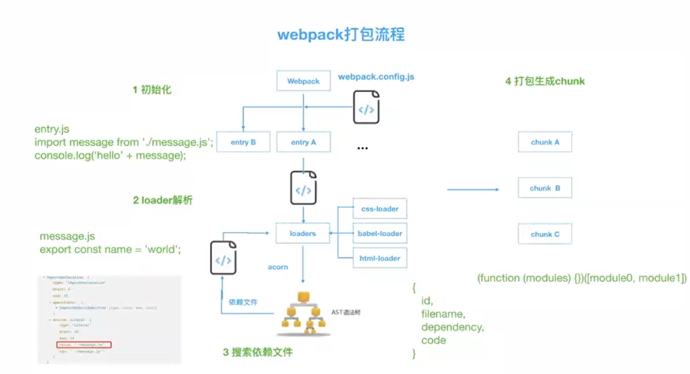
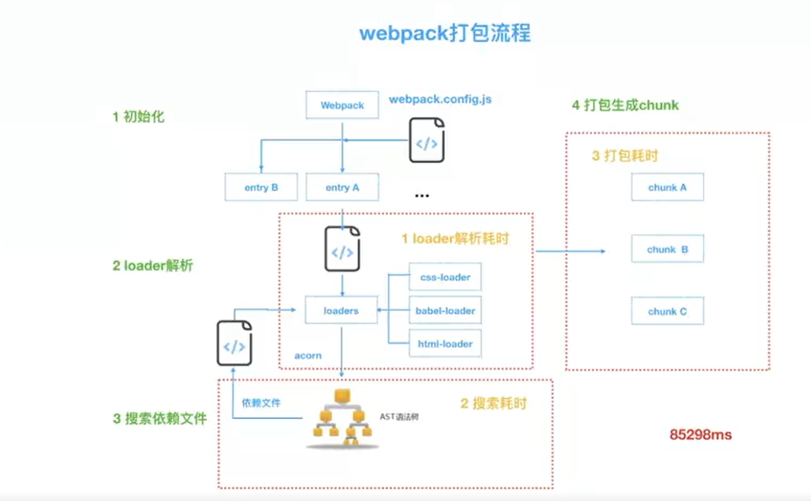
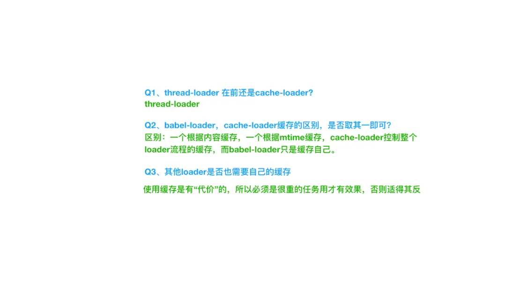
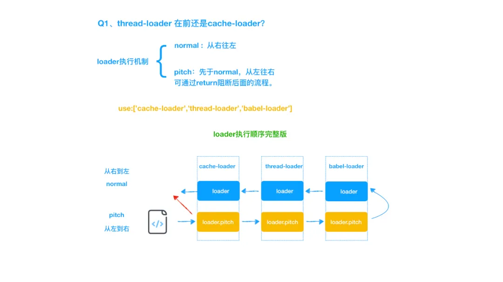
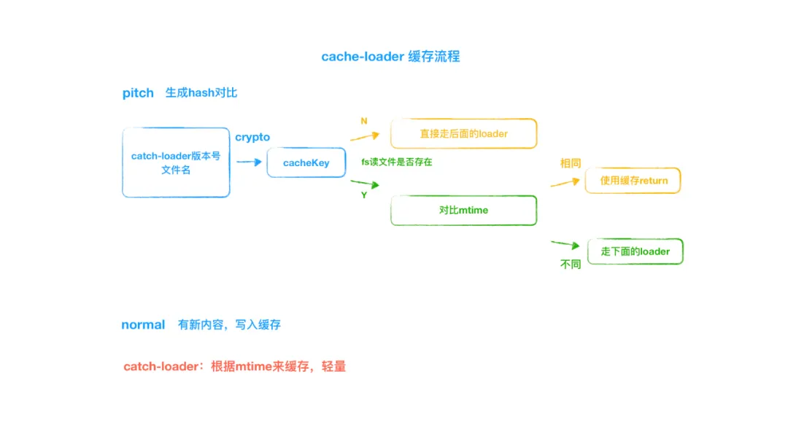
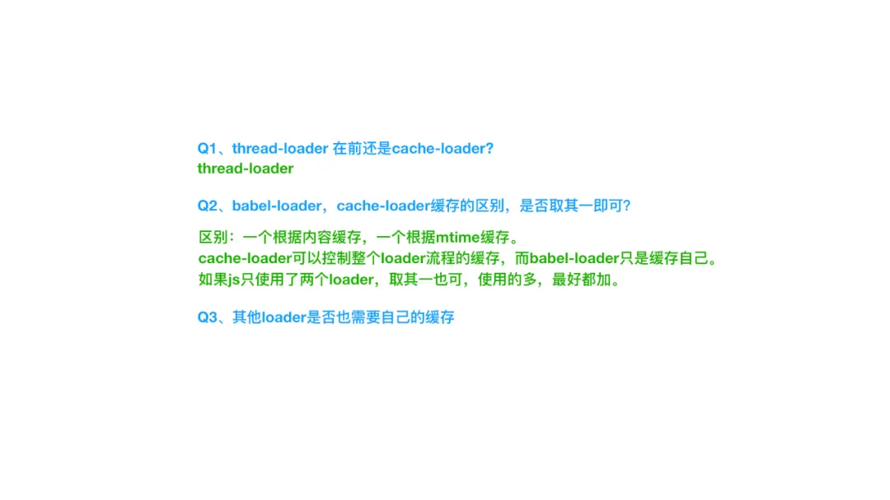
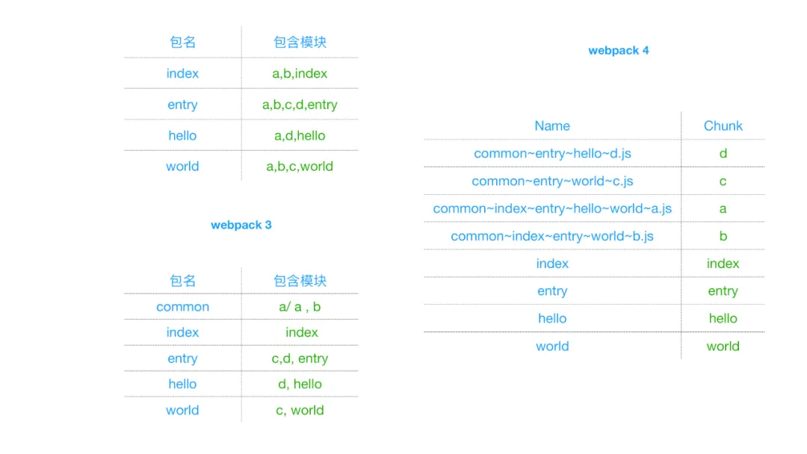

#### 构建速度常用工具
1. 使用`speed-measure-webpack-plugin`进行构建速度分析
2. 使用`webpack-bundle-analyzer`进行体积分析
3. 多进程、多实例构建：thread-loader(官方推荐)、happypack(由于HappyPack 对file-loader、url-loader 支持的不友好，所以不建议对该loader使用)

#### webpack打包流程

根据上图可以看出，webpack的打包流程主要分为三步：
- `初始化`：根据webpack配置，找到项目的入口文件
- `loader解析`：根据入口文件类型，使用对应的loader进行文件解析，将其解析为AST
- `遍历搜索依赖文件`：根据AST分析入口文件的依赖（ImportDeclaration的source分析），得出依赖文件，同时记录依赖，得到文件的依赖树及一个描述对象记录该模块信息{ id, filename, dependancies, code }；依次遍历所有的依赖文件并递归此过程；；


## webpack打包耗时

根据下图可以看到，webpack的打包耗时主要来源于以下三部分：
- loader解析耗时
- 依赖搜索耗时
- 打包耗时

---

### 缩短解析时间
1. rules使用include或exclude缩小范围
2. 多进程加速loader的解析时间 `thread-loader`
3. 加缓存：`cache-loader`、`babel-loader(cacheDirectory:true)`、`html-webpack-plugin(cache:true(defalut is true))`

#### Questions



#### loader机制

> loader的执行顺序是从右到左取值执行；但是每个loader都有一个`pitch方法`，其执行顺序与loader的Normal方法执行顺序相反，是`从左至右`的

`这些 pitch 函数并不是用来实际处理 module 的内容`的，主要是可以利用 module 的 request，来`做一些拦截处理的工作`，从而达到在 loader 处理流程当中的一些定制化的处理需要

> 由于`thread-load`和`cache-loader`的主要功能都是放在其`pitch`方法中的，所以在`loaders配置中放在前面`




#### babel-loader与cache-loader都有缓存机制，是不是只需要一个就可以

|名称|机制|特点|
|--|--|--|
|babel-loader|根据内容缓存（对比内容）|只缓存自己，比较重，计算量较大|
|cache-loader|根据mtime缓存（不对比文件内容，只对比修改时间，轻量级的cache）|控制整个loader流程的缓存，有一个未缓存会直接return|

babel-loader: 
cache-loader: 





---

### 缩短搜索时间
1. resolve.module：默认是`node_modules` 
2. resolve.alias：通过别名映射路径，让webpack更快地找到路径
3. resolve.extension：文件扩展名，

### 缩短打包时间
1. 缓存生成的`chunk` —— `cache: true`
2. 分包：a.使用数量少、体积小的library；b.多页面应用中使用`splitChunksPlugin；c.移除未引用代码



----

## webpack自定义plugin

可以结合webpack的生命周期钩子，在webpack的构建流程中引入自定义行为

```js
class TestPlugin {
    apply(compiler) {
        // 可以传入自定义参数
        compiler.hooks.beforeRun.tap('TestPlugin', (params) => {
            // 自定义操作
            console.log('this is a test plugin')
        })
    }
}

module.exports = TestPlugin;
```


----

# 撸一个简易 webpack

##  定义 Compiler 类
```js
class Compiler {
    constructor(options) {
        // webpack配置
        const { entry, output } = options;
        // 入口
        this.entry = entry;
        // 出口
        this.output = output;
        // 模块
        this.modules = [];
    }

    // 构建启动
    run() {}

    // 支持浏览器端的模块引入函数require
    generate() {}
}
```

## 解析入口文件，获取AST

使用`@babel/parser`解析获取AST

```js
// webpack.config.js

const path = require('path');
module.exports = {
    entry: './src/index.js',
    output: {
        path: path.resolve(__dirname, './dist'),
        filename: 'main.js'
    },
}
```

```js
// ast获取
const fs = require('fs');
const parser = require('@babel/parser');
const options = require('./webpack.config');

const Parser = {
    getAst: path => {
        // 读取文件
        const content = fs.readFileSync(path, 'utf-8');

        // 解析js为ast
        return parser.parse(content, {
            sourceType: 'module'
        })
    }
}

class Compiler {
    constructor(options) {
        // webpack配置
        const { entry, output } = options;
        // 入口
        this.entry = entry;
        // 出口
        this.output = output;
        // 模块
        this.modules = [];
    }

    // 构建启动
    run() {
        const asst = Parser.getAst(this.entry);
    }

    // 支持浏览器端的模块引入函数require
    generate() {}
}

new Compiler(options).run();

```

## 找出所有的模块依赖

找出模块依赖需要遍历AST树，可以通过babel的`traverse`方法；

```js
const fs = require('fs');
const path = require('path');
const parser = require('@babel/parser');
const options = require('./webpack.config');
const traverse = require('@babel/traverse').default;

const Parser = {
    getAst: path => {
        // 读取文件
        const content = fs.readFileSync(path, 'utf-8');

        // 解析js为ast
        return parser.parse(content, {
            sourceType: 'module'
        })
    },
    getDependencies: (ast, filename) => {
        // 遍历所有的 import 模块,存入dependecies
        const dependencies = {};

        traverse(ast, {
            ImportDeclaration(path) {
                const dirname = path.dirname(filename);
                const node = path.node;
                sourceVal = node.source.value;
                const filePath = './' + path.join(dirname, sourceVal);
                dependencies[sourceVal] = filePath;
            }
        });

        return dependencies;
    }
}

class Compiler {
    constructor(options) {
        // webpack配置
        const { entry, output } = options;
        // 入口
        this.entry = entry;
        // 出口
        this.output = output;
        // 模块
        this.modules = [];
    }

    // 构建启动
    run() {
        const { getAst, getDependencies } = Parser;
        const ast = getAst(this.entry);
        const dependencies = getDependencies(ast, this.entry);
    }

    // 支持浏览器端的模块引入函数require
    generate() {}
}

new Compiler(options).run();

```

## AST还原为code

借助`@bable-core`的`transformFromAst`方法，

```js
const fs = require('fs');
const path = require('path');
const parser = require('@babel/parser');
const options = require('./webpack.config');
const traverse = require('@babel/traverse').default;
const { transformFromAst } = require('@babel/core');

const Parser = {
    getAst: path => {
        // 读取文件
        const content = fs.readFileSync(path, 'utf-8');

        // 解析js为ast
        return parser.parse(content, {
            sourceType: 'module'
        })
    },
    getDependencies: (ast, filename) => {
        // 遍历所有的 import 模块,存入dependecies
        const dependencies = {};

        traverse(ast, {
            ImportDeclaration(path) {
                const dirname = path.dirname(filename);
                const node = path.node;
                sourceVal = node.source.value;
                const filePath = './' + path.join(dirname, sourceVal);
                dependencies[sourceVal] = filePath;
            }
        });

        return dependencies;
    },
    getCode: ast => {
        transformFromAst(ast, null, {
            presets: ['@babel/preset-env']
        })
    }
}

class Compiler {
    constructor(options) {
        // webpack配置
        const { entry, output } = options;
        // 入口
        this.entry = entry;
        // 出口
        this.output = output;
        // 模块
        this.modules = [];
    }

    // 构建启动
    run() {
        const { getAst, getDependencies } = Parser;
        const ast = getAst(this.entry);
        const dependencies = getDependencies(ast, this.entry);
        const code = getCode(ast);
    }

    // 支持浏览器端的模块引入函数require
    generate() {}
}

new Compiler(options).run();

```

## 递归解析依赖形成依赖图

```js
const fs = require('fs');
const path = require('path');
const parser = require('@babel/parser');
const options = require('./webpack.config');
const traverse = require('@babel/traverse').default;
const { transformFromAst } = require('@babel/core');

const Parser = {
    getAst: path => {
        // 读取文件
        const content = fs.readFileSync(path, 'utf-8');

        // 解析js为ast
        return parser.parse(content, {
            sourceType: 'module'
        })
    },
    getDependencies: (ast, filename) => {
        // 遍历所有的 import 模块,存入dependecies
        const dependencies = {};

        traverse(ast, {
            ImportDeclaration(path) {
                const dirname = path.dirname(filename);
                const node = path.node;
                sourceVal = node.source.value;
                const filePath = './' + path.join(dirname, sourceVal);
                // 模块名作为索引，路径作为value
                dependencies[sourceVal] = filePath;
            }
        });

        return dependencies;
    },
    getCode: ast => {
        transformFromAst(ast, null, {
            presets: ['@babel/preset-env']
        })
    }
}

class Compiler {
    constructor(options) {
        // webpack配置
        const { entry, output } = options;
        // 入口
        this.entry = entry;
        // 出口
        this.output = output;
        // 模块
        this.modules = [];
    }

    build(filename) {
        const { getAst, getDependencies } = Parser;
        const ast = getAst(this.entry);
        const dependencies = getDependencies(ast, filename);
        const code = getCode(ast);
        return {
            // 文件路径,可以作为每个模块的唯一标识符
            filename,
            // 依赖对象,保存着依赖模块路径
            dependencies,
            code,
        }
    }

    // 构建启动
    run() {
        // 解析入口文件
        const info = this.build(this.entry);
        this.modules.push(info);
        this.modules.forEach({ dependencies } => {
            if (dependencies) {
                for (const dependency in dependencies) {
                    const subInfo = this.build(dependencies[dependency])
                    this.modules.push(subInfo);
                }
            }
        });
        // 生成依赖关系图
        const dependenciesGraph = this.modules.reduce(
            (graph, item) => ({
                ...graph,
                [item.filename]: {
                    dependencies: item.dependencies,
                    code: item.code
                }
            }),
            {}
        );
    }

    // 重写 require函数使之支持浏览器模块引入,输出bundle
    generate() {}
}

new Compiler(options).run();

```

## 重写require函数，输出bundle
```js
const fs = require('fs');
const path = require('path');
const parser = require('@babel/parser');
const options = require('./webpack.config');
const traverse = require('@babel/traverse').default;
const { transformFromAst } = require('@babel/core');

const Parser = {
    getAst: path => {
        // 读取文件
        const content = fs.readFileSync(path, 'utf-8');

        // 解析js为ast
        return parser.parse(content, {
            sourceType: 'module'
        })
    },
    getDependencies: (ast, filename) => {
        // 遍历所有的 import 模块,存入dependecies
        const dependencies = {};

        traverse(ast, {
            ImportDeclaration(path) {
                const dirname = path.dirname(filename);
                const node = path.node;
                sourceVal = node.source.value;
                const filePath = './' + path.join(dirname, sourceVal);
                // 模块名作为索引，路径作为value
                dependencies[sourceVal] = filePath;
            }
        });

        return dependencies;
    },
    getCode: ast => {
        transformFromAst(ast, null, {
            presets: ['@babel/preset-env']
        })
    }
}

class Compiler {
    constructor(options) {
        // webpack配置
        const { entry, output } = options;
        // 入口
        this.entry = entry;
        // 出口
        this.output = output;
        // 模块
        this.modules = [];
    }

    build(filename) {
        const { getAst, getDependencies } = Parser;
        const ast = getAst(this.entry);
        const dependencies = getDependencies(ast, filename);
        const code = getCode(ast);
        return {
            // 文件路径,可以作为每个模块的唯一标识符
            filename,
            // 依赖对象,保存着依赖模块路径
            dependencies,
            code,
        }
    }


    //  (浏览器不能识别commonjs语法) 重写 require函数使之支持浏览器模块引入,输出bundle
    generate(code) {
        // 输出路径
        const filePath = path.join(this.output.path, this.output.filename);
        const bundle =  `
            (function(graph){
                function require(module){
                    function localRequire(relativePath){
                        return require(graph[module].dependecies[relativePath])
                    }
                    var exports = {};
                    (function(require,exports,code){
                        eval(code)
                    })(localRequire,exports,graph[module].code);
                    return exports;
                }
                require('${this.entry}')
            })(${JSON.stringify(code)})
        `;

        // 把文件内容写入到文件系统
        fs.writeFileSync(filePath, bundle, 'utf-8')
    }

    // 构建启动
    run() {
        // 解析入口文件
        const info = this.build(this.entry);
        this.modules.push(info);
        this.modules.forEach({ dependencies } => {
            if (dependencies) {
                for (const dependency in dependencies) {
                    const subInfo = this.build(dependencies[dependency])
                    this.modules.push(subInfo);
                }
            }
        });
        // 生成依赖关系图
        const dependenciesGraph = this.modules.reduce(
            (graph, item) => ({
                ...graph,
                [item.filename]: {
                    dependencies: item.dependencies,
                    code: item.code
                }
            }),
            {}
        );

        this.generate(dependencyGraph);
    }
}

new Compiler(options).run();

```

代码参考[https://github.com/webfansplz/article/tree/master/easy-webpack](https://github.com/webfansplz/article/tree/master/easy-webpack)


## 参考文献
1. [webpack打包原理 ? 看完这篇你就懂了 !](https://segmentfault.com/a/1190000021494964)
